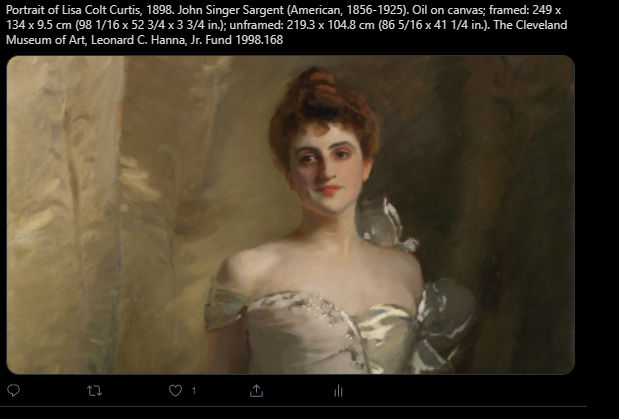
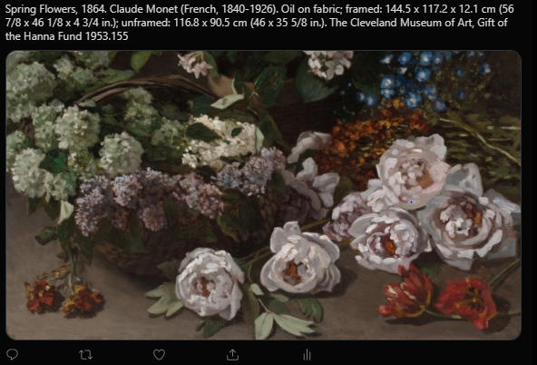
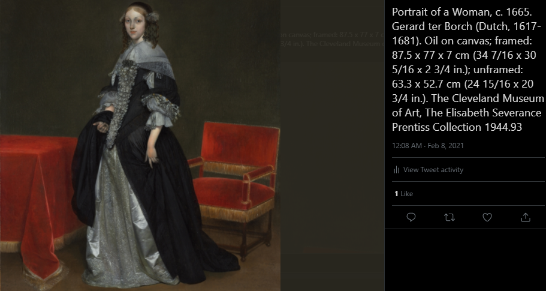

# Cleveland_museum_art_bot
Simple twitter bot. 
the Cleveland Museum of Art has an open access API and a lot of helpful documentation, check them out here: 
https://www.clevelandart.org/open-access

This program accesses the API, picks a painting at random then tweets the image. List of libraries used is included in the requirements.txt file.

